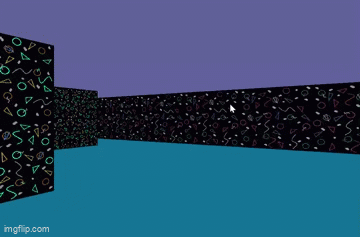

# cub3d

🌈RainbowCube🌈 is a project where we make our first 3D game with raycasting!    
If you are looking for inspiration/help for your own cub3d, specifically the raycaster/texture part, feel free to take a look at the `cub3d.h` header!  
We used the [42Docs tutorial](https://lodev.org/cgtutor/raycasting.html) for the raycasting. However, we changed the variable names to make it more understandable for us, and for better structure. In the `cub3d.h` header, it is noted which variables are which to be able to connect our version to the tutorial.  
We have some minor changes, which are usually noted on top of the functions they're in. Completely selfmade are:
- left-right movement (which is not implemented in the tutorial)
- texture-pixel-putting (see function `tex_rgba()`)
- also the movement is restructured into multiple functions, but still works the same as in the tutorial    

if you need some personal help with it, you can also contact me, `@shaas` on 42 Slack :)  
Happy coding🌈
